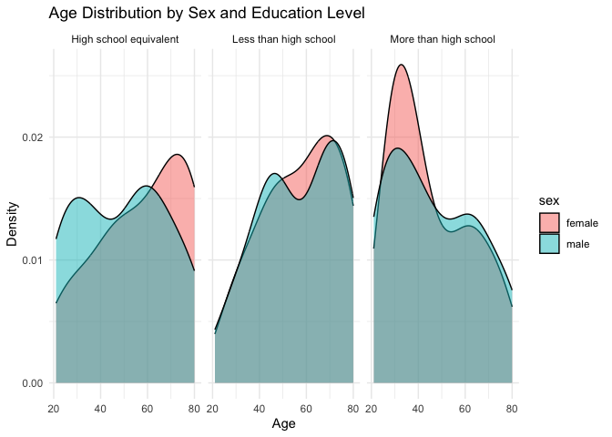

p8105_hw3_hl3859
================
Hanrui Li
2024-10-16

# Problem 1

``` r
library(tidyverse)
library(p8105.datasets)

data("ny_noaa")

ny_noaa_cleaned <- ny_noaa |>
  mutate(
    year = lubridate::year(date),
    month = lubridate::month(date),
    day = lubridate::day(date),
    tmax = as.numeric(tmax) / 10,
    tmin = as.numeric(tmin) / 10,
    prcp = as.numeric(prcp) / 10
  )

snowfall_values <- ny_noaa_cleaned |>
  count(snow) |>
  arrange(desc(n)) |>
  head(10)

snowfall_values
```

    ## # A tibble: 10 × 2
    ##     snow       n
    ##    <int>   <int>
    ##  1     0 2008508
    ##  2    NA  381221
    ##  3    25   31022
    ##  4    13   23095
    ##  5    51   18274
    ##  6    76   10173
    ##  7     8    9962
    ##  8     5    9748
    ##  9    38    9197
    ## 10     3    8790

The most common values for snowfall typically include 0, as most days
may not experience snow, particularly in non-winter months or in
locations where snowfall is rare.

``` r
jan_jul_data <- ny_noaa_cleaned |>
  filter(month %in% c(1, 7)) |>
  group_by(id, year, month) |>
  summarize(avg_tmax = mean(tmax, na.rm = TRUE)) |>
  ungroup()

ggplot(jan_jul_data, aes(x = year, y = avg_tmax, color = factor(month))) +
  geom_line() +
  facet_wrap(~ month) +
  labs(
    title = "Average Max Temperature in January and July across Stations",
    x = "Year",
    y = "Average Max Temperature (°C)"
  )
```

<!-- -->

There is a clear distinction between January and July temperatures, with
January showing colder temperatures (often below freezing) and July
exhibiting warmer temperatures (mostly above 20°C). There seems to be a
slight warming trend in January temperatures over the years, which could
be interpreted as part of the broader trend of global warming. This is
less clear in the July data, which remains relatively stable.

January: As noted, there are some extreme cold outliers in the January
panel, where the maximum temperatures drop significantly below 0°C.
These outliers suggest that certain years had particularly severe cold
snaps. July: A few years have notably lower maximum temperatures, likely
representing cool or anomalous summers.

## (i)

``` r
ggplot(ny_noaa_cleaned, aes(x = tmin, y = tmax)) +
  geom_bin2d() + 
  scale_fill_viridis_c() +
  labs(
    title = "Relationship Between Max and Min Temperatures",
    x = "Minimum Temperature (°C)",
    y = "Maximum Temperature (°C)"
  )
```

<!-- -->

## (ii)

``` r
snowfall_dist <- ny_noaa_cleaned |>
  filter(snow > 0, snow < 100) |>
  group_by(year) |>
  summarize(avg_snow = mean(snow, na.rm = TRUE))

ggplot(snowfall_dist, aes(x = year, y = avg_snow)) +
  geom_col() +
  labs(
    title = "Average Snowfall Distribution by Year",
    x = "Year",
    y = "Average Snowfall (mm)"
  )
```

<!-- -->

# Problem 2

## Load, tidy, merge, and otherwise organize the data sets

``` r
library(tidyverse)
library(ggplot2)

demographic <- read.csv("nhanes_covar.csv", skip = 4) |>
  janitor::clean_names() |>
  mutate(sex = recode(sex, `1` = "male", `2` = "female"),
         education = recode(education, `1` = "Less than high school", 
                            `2` = "High school equivalent", 
                            `3` = "More than high school"))

accel <- read.csv("nhanes_accel.csv") |>
  janitor::clean_names()

demographic_cleaned <- demographic |>
  filter(age >= 21) |>
  drop_na()

merged <- merge(demographic_cleaned, accel, by = "seqn")
```

## Produce a reader-friendly table for the number of men and women in each education category

``` r
gender_education_table <- merged |>
  group_by(education, sex) |>
  summarise(Count = n()) |>
  ungroup()

knitr::kable(gender_education_table)
```

| education              | sex    | Count |
|:-----------------------|:-------|------:|
| High school equivalent | female |    23 |
| High school equivalent | male   |    35 |
| Less than high school  | female |    28 |
| Less than high school  | male   |    27 |
| More than high school  | female |    59 |
| More than high school  | male   |    56 |

Less than high school: The number of participants is nearly balanced
between males (27) and females (28).

High school equivalent: There is a slight gender imbalance with more
males (35) than females (23).

More than high school: Both males (56) and females (59) are well
represented, showing a fairly even distribution across genders.

In general, participants with “More than high school” education make up
the largest group, followed by “High school equivalent,” with “Less than
high school” having the fewest participants. This reflects the general
trend of higher educational attainment among the participants.

## Create a visualization of the age distributions for men and women in each education category

``` r
ggplot(merged, aes(x = age, fill = sex)) +
  geom_density(alpha = 0.5) +
  facet_wrap(~ education) +
  labs(title = "Age Distribution by Sex and Education Level",
       x = "Age",
       y = "Density") +
  theme_minimal()
```

<!-- -->

High school equivalent: Males and females show a similar age
distribution, with a large concentration of participants between 40 and
60 years. There’s a small divergence in older ages, with slightly more
males in their early 40s and late 50s.

Less than high school: The age distribution skews older for both males
and females. The peak for females is around 70 years, while for males,
it’s slightly lower, around 60. This could indicate that older
participants tend to have lower education levels.

More than high school: Participants are more evenly distributed across
age groups for both genders, with more participants in their 50s and
60s. Females tend to dominate the older age group (70+), while males are
more evenly spread across age ranges.

Males tend to have a slightly wider spread across age groups in all
education levels, while females tend to peak more sharply in specific
age ranges, particularly among the less educated. As education level
increases, the age distribution becomes broader, indicating that
participants with higher education levels are more evenly distributed
across various age groups. Conversely, those with lower education levels
tend to be older. This may suggest that older generations had less
access to education compared to younger participants.

## Create a total activity variable for each participant

``` r
merged$total_activity <- rowSums(merged[, grep("MIMS", colnames(merged))])

ggplot(merged, aes(x = age, y = total_activity, color = sex)) +
  geom_point() +
  geom_smooth(method = "lm", se = FALSE) +
  facet_wrap(~ education) +
  labs(title = "Total Activity vs Age by Gender and Education Level",
       x = "Age",
       y = "Total Activity (MIMS)") +
  theme_minimal()
```

<!-- -->
