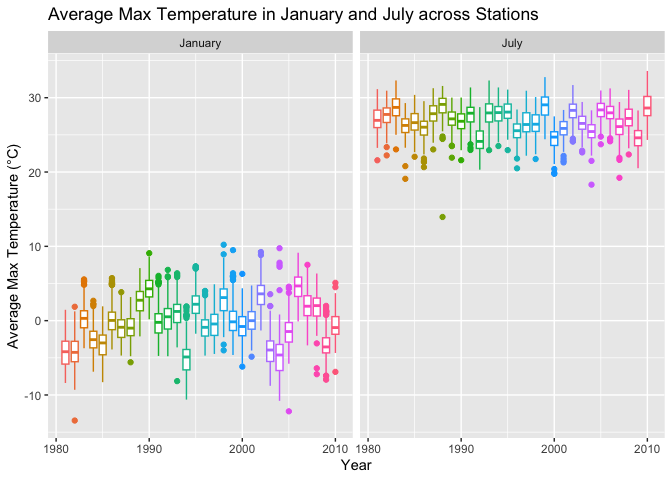
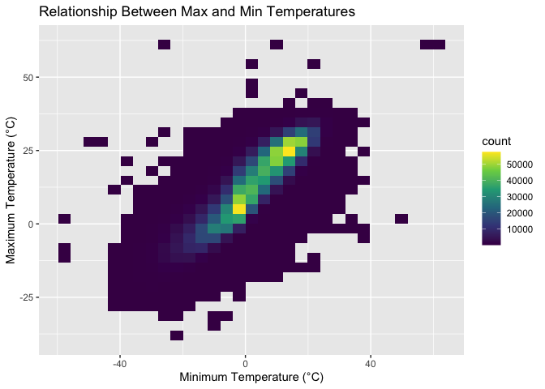
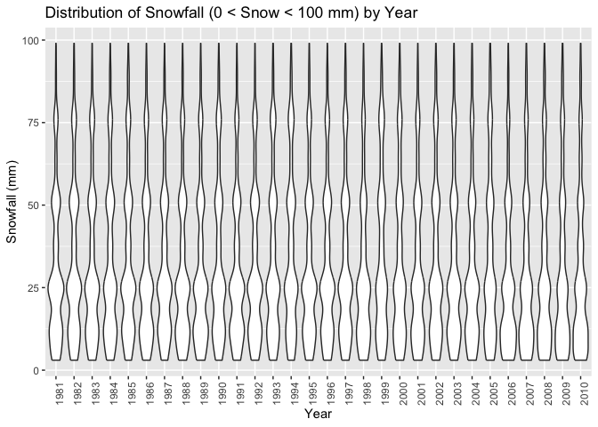
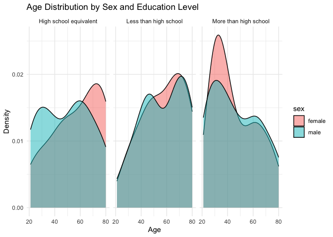
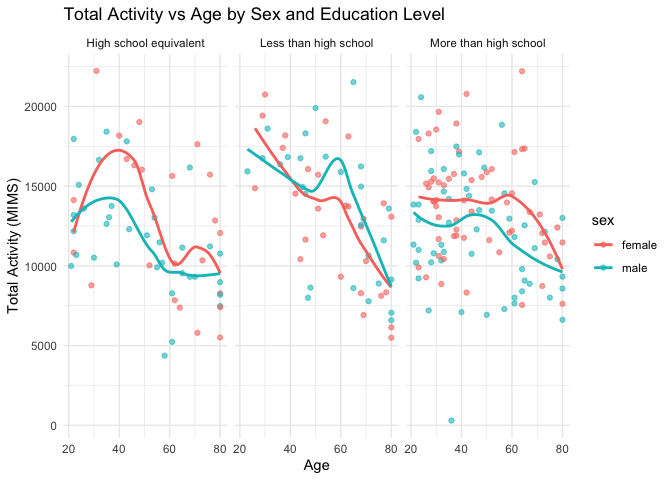
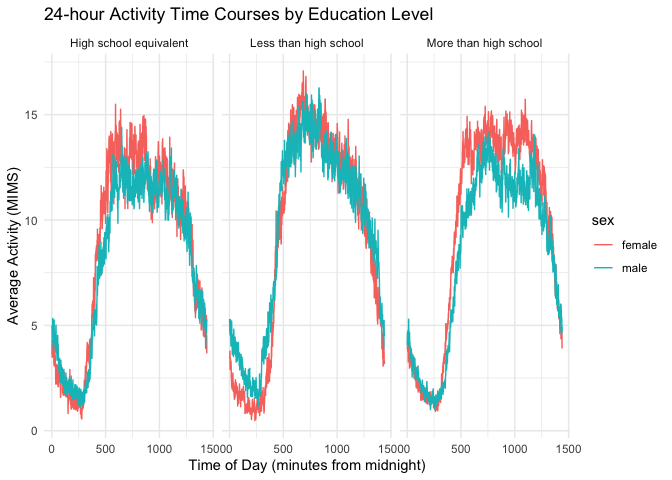

p8105_hw3_hl3859
================
Hanrui Li
2024-10-16

# Problem 1

### Import the dataset

``` r
library(tidyverse)
library(p8105.datasets)

data("ny_noaa")
```

The `ny_noaa` has 2595176 observations and 7 variables.

- `date`: Observation date (e.g., 2007-11-01)

- `prcp`: Precipitation (tenths of mm)

- `snow`: Snowfall (mm)

- `snwd`: Snow depth (mm)

- `tmax`: Maximum temperature (tenths of degree Celsius)

- `tmin`: Maximum and minimum temperature (tenths of degree Celsius)

There are 3387623 missing values.

### Clean the dataset

``` r
ny_noaa_cleaned <- ny_noaa |>
  mutate(
    year = lubridate::year(date),
    month = lubridate::month(date),
    day = lubridate::day(date),
    tmax = as.numeric(tmax) / 10,
    tmin = as.numeric(tmin) / 10,
    prcp = as.numeric(prcp) / 10
  )

ny_noaa_cleaned |>
  count(snow) |>
  drop_na(snow) |>
  arrange(desc(n)) |>
  head(10) |>
  knitr::kable()
```

| snow |       n |
|-----:|--------:|
|    0 | 2008508 |
|   25 |   31022 |
|   13 |   23095 |
|   51 |   18274 |
|   76 |   10173 |
|    8 |    9962 |
|    5 |    9748 |
|   38 |    9197 |
|    3 |    8790 |
|  102 |    6552 |

The most common values for snowfall typically include 0 (2008508
observations), 25 (31022 observations), and 13 (23095 observations), as
most days may not experience snow, particularly in non-winter months or
in locations where snowfall is rare.

### Show the average max temperature in January and in July in each station across years

``` r
ny_noaa_cleaned |>
  filter(month %in% c(1, 7)) |>
  group_by(year, month, id) |>
  summarize(avg_tmax = mean(tmax, na.rm = TRUE), .groups = "drop") |>
  mutate(month = factor(month, labels = c("January", "July"))) |>
  ggplot(aes(x = year, y = avg_tmax, color = factor(year))) +
  geom_boxplot() +
  facet_grid(.~ month) +
  labs(
    title = "Average Max Temperature in January and July across Stations",
    x = "Year",
    y = "Average Max Temperature (°C)"
  ) +
  theme(legend.position = "none")
```

<!-- -->

January shows lower average temperatures (often below freezing) and July
shows higher average temperatures (mostly above 20°C). This is
reasonable as January is in winter and July is in summer.

There are some outliers (shown as dots) in the January panel, where the
maximum temperatures drop significantly below 0°C. In July, there are
notably lower maximum temperatures, likely representing cool summers.

### (i) `tmax` vs `tmin` for the full dataset

``` r
ggplot(ny_noaa_cleaned, aes(x = tmin, y = tmax)) +
  geom_bin2d() + 
  scale_fill_viridis_c() +
  labs(
    title = "Relationship Between Max and Min Temperatures",
    x = "Minimum Temperature (°C)",
    y = "Maximum Temperature (°C)"
  )
```

<!-- -->

### (ii) distribution of snowfall values greater than 0 and less than 100 separately by year

``` r
ny_noaa_cleaned |>
  filter(snow > 0, snow < 100) |>
  group_by(year) |>
  ggplot(aes(x = factor(year), y = snow)) +
  geom_violin() +
  labs(
    title = "Distribution of Snowfall (0 < Snow < 100 mm) by Year",
    x = "Year",
    y = "Snowfall (mm)"
  ) +
  theme(axis.text.x = element_text(angle = 90, hjust = 1))
```

<!-- -->

# Problem 2

### Load, tidy, merge, and otherwise organize the data sets

``` r
library(tidyverse)
library(ggplot2)

demographic <- read.csv("data/nhanes_covar.csv", na = c("NA", ",", ""), skip = 4) |>
  janitor::clean_names() |>
  mutate(sex = factor(case_when(sex == 1 ~ "male", sex == 2 ~ "female")),
         education = factor(case_when(education == 1 ~ "Less than high school", 
                                      education == 2 ~ "High school equivalent", 
                                      education == 3 ~ "More than high school")))

accel <- read.csv("data/nhanes_accel.csv", na = c("NA", ",", "")) |>
  janitor::clean_names()

demographic_cleaned <- demographic |>
  filter(age >= 21) |>
  drop_na()

merged <- merge(demographic_cleaned, accel, by = "seqn")
```

### Produce a reader-friendly table for the number of men and women in each education category

``` r
merged |>
  group_by(education, sex) |>
  janitor::tabyl(education, sex) |>
  knitr::kable()
```

| education              | female | male |
|:-----------------------|-------:|-----:|
| High school equivalent |     23 |   35 |
| Less than high school  |     28 |   27 |
| More than high school  |     59 |   56 |

For Less than high school, the number of participants is nearly balanced
between males (27) and females (28). For High school equivalent, there
is a slight gender imbalance with more males (35) than females (23). For
More than high school, both males (56) and females (59) are well
represented, showing a fairly even distribution across genders.

In general, participants with “More than high school” education make up
the largest group, followed by “High school equivalent,” with “Less than
high school” having the fewest participants. This reflects the general
trend of higher educational attainment among the participants.

### Create a visualization of the age distributions for men and women in each education category

``` r
ggplot(merged, aes(x = age, fill = sex)) +
  geom_density(alpha = 0.5) +
  facet_wrap(~ education) +
  labs(title = "Age Distribution by Sex and Education Level",
       x = "Age",
       y = "Density") +
  theme_minimal()
```

<!-- -->

For High school equivalent, males and females show a similar age
distribution, with a large concentration of participants between 40 and
60 years. There is a small divergence in older ages, with slightly more
males in their early 40s and late 50s.

For Less than high school, the age distribution skews older for both
males and females. The peak for females is around 70 years, while for
males, it is slightly lower, around 60. This could indicate that older
participants tend to have lower education levels.

For More than high school, participants are more evenly distributed
across age groups for both genders, with more participants in their 50s
and 60s. Females tend to dominate the older age group (70+), while males
are more evenly spread across age ranges.

Males tend to have a slightly wider spread across age groups in all
education levels, while females tend to peak more sharply in specific
age ranges, particularly among the less educated. As education level
increases, the age distribution becomes broader, indicating that
participants with higher education levels are more evenly distributed
across various age groups. Conversely, those with lower education levels
tend to be older. This may suggest that older generations had less
access to education compared to younger participants.

### Focus on total activity

``` r
merged <- merged |>
  mutate(total_activity = rowSums(select(merged, starts_with("min"))))

ggplot(merged, aes(x = age, y = total_activity, color = sex)) +
  geom_point(alpha = 0.6) + 
  geom_smooth(method = "loess", se = FALSE) +
  facet_wrap(~ education) + 
  labs(title = "Total Activity vs Age by Sex and Education Level",
       x = "Age",
       y = "Total Activity (MIMS)") +
  theme_minimal() +
  theme(legend.position = "right")
```

<!-- -->

Across all education levels, total activity tends to decline with age.
This is most noticeable among participants older than 60, where both
males and females show a sharp drop in total activity. For younger
participants (around 20–40 years), activity levels appear more varied,
particularly in the “High school equivalent” and “More than high school”
groups. This could indicate a broader range of physical activity habits
in younger individuals.

For High School Equivalent, males and females have similar levels of
activity, with a slight decline in total activity for both genders as
they approach middle age. However, there are spikes in activity around
ages 40-50 for females and a more consistent decline for males.

For Less than High School, females tend to have higher activity levels
than males from age 20 to 50, but this changes after age 50, where both
males and females show a steep drop-off in activity.

For More than High School, there is a slight fluctuation in activity for
both males and females around middle age, but total activity tends to
plateau or decline slightly after the age of 50. This group shows the
most consistency in activity levels for both genders, with less
variation in total activity across age groups. This suggests that
participants with higher education levels may have more stable physical
activity patterns.

In all groups, there are notable outliers, particularly in younger age
ranges, where some individuals have very high total activity levels
compared to others.

### Make a three-panel plot that shows the 24-hour activity time courses for each education level

``` r
merged |>
  pivot_longer(cols = starts_with("min"),
               names_to = "Time",
               values_to = "Activity") |>
  ggplot(aes(x = as.numeric(gsub("min", "", Time)), y = Activity, color = sex)) +
  geom_line(stat = "summary", fun = "mean") +
  facet_wrap(~ education) +
  labs(title = "24-hour Activity Time Courses by Education Level",
       x = "Time of Day (minutes from midnight)",
       y = "Average Activity (MIMS)") +
  theme_minimal()
```

<!-- -->

The participants, regardless of education level, tend to follow a daily
pattern of higher activity in the morning and afternoon, with a drop
during the night and a midday lull. This is consistent with typical
daily schedules, work hours, and rest periods.

Participants with higher education (“More than high school”) have more
consistent activity levels across the day, with smaller differences
between men and women. This may reflect more regulated daily routines,
possibly due to structured work environments or more regular exercise
patterns.

Those with “Less than high school” education tend to exhibit higher
overall activity during peak times, which could indicate physically
demanding jobs or less sedentary lifestyles. Women in this group, in
particular, show more pronounced activity peaks, suggesting higher daily
physical exertion.

# Problem 3
