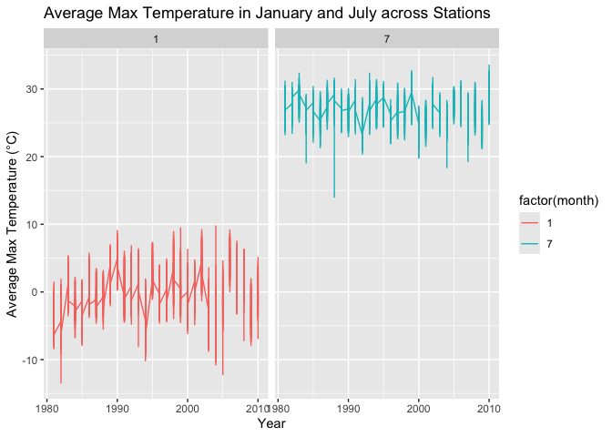

p8105_hw3_hl3859
================
Hanrui Li
2024-10-16

# Problem 1

``` r
library(tidyverse)
```

    ## ── Attaching core tidyverse packages ──────────────────────── tidyverse 2.0.0 ──
    ## ✔ dplyr     1.1.4     ✔ readr     2.1.5
    ## ✔ forcats   1.0.0     ✔ stringr   1.5.1
    ## ✔ ggplot2   3.5.1     ✔ tibble    3.2.1
    ## ✔ lubridate 1.9.3     ✔ tidyr     1.3.1
    ## ✔ purrr     1.0.2     
    ## ── Conflicts ────────────────────────────────────────── tidyverse_conflicts() ──
    ## ✖ dplyr::filter() masks stats::filter()
    ## ✖ dplyr::lag()    masks stats::lag()
    ## ℹ Use the conflicted package (<http://conflicted.r-lib.org/>) to force all conflicts to become errors

``` r
library(p8105.datasets)

data("ny_noaa")

ny_noaa_cleaned <- ny_noaa |>
  mutate(
    year = lubridate::year(date),
    month = lubridate::month(date),
    day = lubridate::day(date),
    tmax = as.numeric(tmax) / 10,
    tmin = as.numeric(tmin) / 10,
    prcp = as.numeric(prcp) / 10
  )

snowfall_values <- ny_noaa_cleaned |>
  count(snow) |>
  arrange(desc(n)) |>
  head(10)

print(snowfall_values)
```

    ## # A tibble: 10 × 2
    ##     snow       n
    ##    <int>   <int>
    ##  1     0 2008508
    ##  2    NA  381221
    ##  3    25   31022
    ##  4    13   23095
    ##  5    51   18274
    ##  6    76   10173
    ##  7     8    9962
    ##  8     5    9748
    ##  9    38    9197
    ## 10     3    8790

The most common values for snowfall typically include 0, as most days
may not experience snow, particularly in non-winter months or in
locations where snowfall is rare.

``` r
jan_jul_data <- ny_noaa_cleaned |>
  filter(month %in% c(1, 7)) |>
  group_by(id, year, month) |>
  summarize(avg_tmax = mean(tmax, na.rm = TRUE)) |>
  ungroup()
```

    ## `summarise()` has grouped output by 'id', 'year'. You can override using the
    ## `.groups` argument.

``` r
ggplot(jan_jul_data, aes(x = year, y = avg_tmax, color = factor(month))) +
  geom_line() +
  facet_wrap(~ month) +
  labs(
    title = "Average Max Temperature in January and July across Stations",
    x = "Year",
    y = "Average Max Temperature (°C)"
  )
```

<!-- -->

There is a clear distinction between January and July temperatures, with
January showing colder temperatures (often below freezing) and July
exhibiting warmer temperatures (mostly above 20°C). There seems to be a
slight warming trend in January temperatures over the years, which could
be interpreted as part of the broader trend of global warming. This is
less clear in the July data, which remains relatively stable.

January: As noted, there are some extreme cold outliers in the January
panel, where the maximum temperatures drop significantly below 0°C.
These outliers suggest that certain years had particularly severe cold
snaps. July: A few years have notably lower maximum temperatures, likely
representing cool or anomalous summers.

## (i)

``` r
ggplot(ny_noaa_cleaned, aes(x = tmin, y = tmax)) +
  geom_bin2d() + 
  scale_fill_viridis_c() +
  labs(
    title = "Relationship Between Max and Min Temperatures",
    x = "Minimum Temperature (°C)",
    y = "Maximum Temperature (°C)"
  )
```

    ## Warning: Removed 1136276 rows containing non-finite outside the scale range
    ## (`stat_bin2d()`).

<!-- -->

## (ii)

``` r
snowfall_dist <- ny_noaa_cleaned |>
  filter(snow > 0, snow < 100) |>
  group_by(year) |>
  summarize(avg_snow = mean(snow, na.rm = TRUE))

ggplot(snowfall_dist, aes(x = year, y = avg_snow)) +
  geom_col() +
  labs(
    title = "Average Snowfall Distribution by Year",
    x = "Year",
    y = "Average Snowfall (mm)"
  )
```

<!-- -->

# Problem 2

``` r
library(tidyverse)
library(ggplot2)

demographic <- read.csv("nhanes_covar.csv", skip = 4) |>
  janitor::clean_names()

accel <- read.csv("nhanes_accel.csv") |>
  janitor::clean_names()

demographic_cleaned <- demographic |>
  filter(age >= 21) |>
  drop_na()

merged <- merge(demographic_cleaned, accel, by = "seqn")
```

``` r
gender_education_table <- merged |>
  group_by(education, sex) |>
  summarise(Count = n()) |>
  ungroup()
```

    ## `summarise()` has grouped output by 'education'. You can override using the
    ## `.groups` argument.

``` r
gender_education_table
```

    ## # A tibble: 6 × 3
    ##   education   sex Count
    ##       <int> <int> <int>
    ## 1         1     1    27
    ## 2         1     2    28
    ## 3         2     1    35
    ## 4         2     2    23
    ## 5         3     1    56
    ## 6         3     2    59
